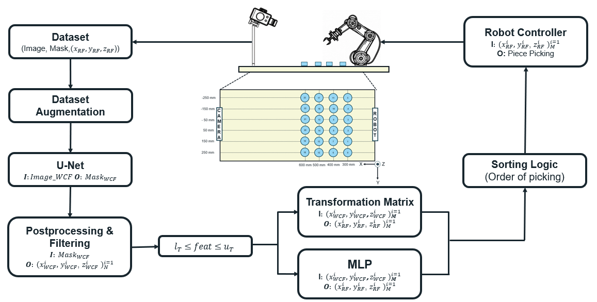

# AI Reliability in Industrial Safety: A Case Study with ABB IRB 1200 and Intel RealSense D415


## Overview
This project investigates the application of advanced AI techniques to enhance industrial safety using the ABB IRB 1200 robotic system and the Intel RealSense D415 camera. Supervised by Mathias Verbeke and Matthias De Ryck at KU Leuven, Faculty of Engineering Technology, this work constitutes a significant part of the academic curriculum for the Master of AI in Business and Industry, academic year 2023-2024.

## Project Description
The primary objective of this study is to assess and improve the reliability of AI systems in industrial environments. By integrating computer vision and robotics, this project aims to enhance the accuracy and safety of the ABB IRB 1200 during its operations.

## Methodology
The project is developed following the CRISP-DM (Cross Industry Standard Process for Data Mining) methodology:

0.- **Business Understanding**: A general overview of the importance of the topic and approaches which have been developed is available in the milestones folder. 

| File Name | Content |
|-----------|---------|
| Summary Milestones.docx | Writen overview of the project and results in each intermediate step |
| Intermediate_presentation.pptx | General Overview of the project. |

1.- **Data Understanding**: Raw images are captured using the Intel RealSense D415 and processed to correct distortions. An HSV filter is applied to generate object masks. The data consists of images, masks (binary maps indicating the location and shape of specific objects for the robot to pick), and ground truth labels (providing the location of the masks in the robot frame).

2.- **Data Preparation**: Specific features of the images and masks are identified. Masks undergo binarization checks, and the dataset is split and augmented with spatial and image-specific transformations (e.g., horizontal and vertical flips, brightness contrast adjustments, Gaussian noise, coarse dropout, blurring) to enhance model performance and prevent overfitting. Additional corruptions (shot noise, impulse noise, defocus blur, glass blur, motion blur, fog, brightness, contrast adjustments) are applied for robustness.

| File Name | Content |
|-----------|---------|
| DataUnderstanding&Preparation.ipynb | Data Visualization, Feature obtaining, binary mask verification, dataset splitting, dataset augmentation. |

3.- **Modelling**: Two segmentation models are trained using U-Net [U-Net Model](https://github.com/zhixuhao/unet.git) and Mask R-CNN architectures. A Region of Interest (ROI) filtering block with HSV filtering and contour analysis is applied, followed by a final filtering block comparing features to those in a healthy (non-corrupted) dataset. The (x,y,z) positions of pieces in the working range are transformed to the robot frame using either transformation matrices from the calibration process or an end-to-end MLP model.

4.- **Evaluation**: Performance is assessed by corrupting images with various corruptions and adjusting image sizes. The metrics used for evaluation are dice score and accuracy. 

| File Name | Content |
|-----------|---------|
| Modelling&Evaluation.ipynb | Model building blocks definition (U-Net, Postprocessing, Filtering, MLP, Trasformation Matrix block), Training and evaluation of each building block.  |
| results/* | This folder contains images with the results of the model which will be commented in the master´s thesis in detail.|

5.- **Deployment**: The end-to-end model is tested on the ABB IRB 1200 robot using the [Robot Demonstrator - Matthias de Ryck](https://github.com/MatthiasDR96/robot_demonstrator.git) as a baseline. 

| File Name | Content |
|-----------|---------|
| main_threaded.py | For the deployment of the model, substitute this file in the "Robot Demonstrator/scripts/main_threaded.py" - Matthias de Ryck github repository|


## Future Work
Future research will focus on improving depth perception in images, refining machine learning models, and expanding the dataset to enhance the generalization of AI models in diverse industrial settings.

## Installation
```bash
cd <Path to the folder you’d like to save this project>
conda create -n <new environment name> python=3.8
conda activate <new environment name>
pip install -r requirements.txt
git clone <link to this repository>
```

## Contributors
- Iñigo Aduna Alonso (Researcher)
- Mathias Verbeke (Supervisor)
- Matthias De Ryck (Supervisor)
